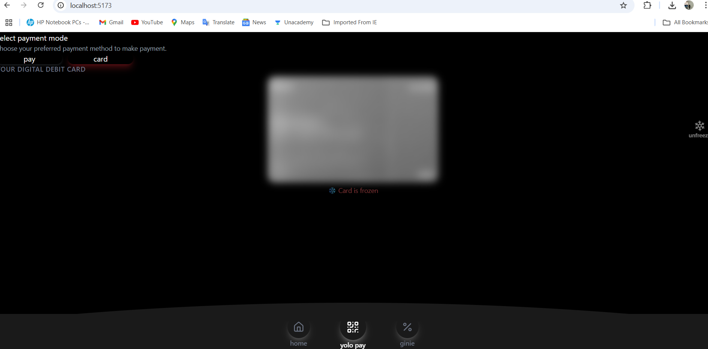

 # YOLO-Payment ❄️💳

A modern React/Vite application featuring:
- ✅ Bottom tab navigation (Home, Freeze, Profile)
- 🥶 Freeze animation on a payment card
- 🔄 Faker.js for generating realistic random user & card data
- ⚡ Smooth animations with Framer Motion

---

## 🚀 Demo Screenshots


### Freeze Screen  


### Bottom Tab Navigation  


---
## 🚀 Live Demo & Deployment

[![Deploy with Vercel] [(https://vercel.com/md-sahil-khans-projects-70856617/yolo-payment)]


## 🧩 Features

- **Home Screen**: Displays a personalized greeting and balance.
- **Freeze Screen**: Shows a stylized card that flips and overlays **FROZEN** when toggled.
- **Profile Screen**: User profile info with fake data.
- **Navigation**: Persistent bottom navigation using React Router.
- **Random Data**: Auto-generated user details using Faker.js.

---

## 🛠 Tech Stack

| Feature         | Technology                   |
|-----------------|------------------------------|
| UI Framework    | React + Tailwind CSS         |
| Bundler         | Vite                         |
| Animations      | Framer Motion                |
| Data Library    | @faker-js/faker              |
| Routing         | React Router v6              |

---

## 🔧 Setup & Run

1. **Install dependencies**  
   ```bash
   npm install
